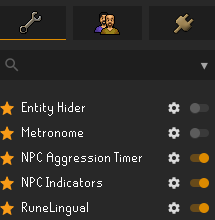
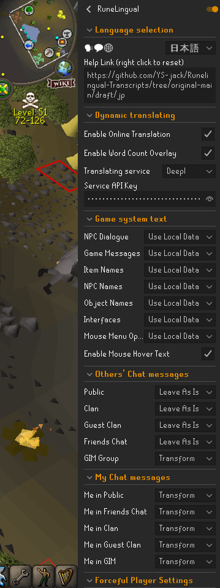
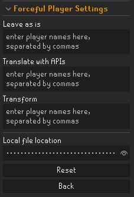

### 設定の使い方

  
  
Your text goes here. This text will be displayed to the right of the image.

  
  
Your text goes here. This text will be displayed to the right of the image.

  
  
Your text goes here. This text will be displayed to the right of the image.

  
  
Your text goes here. This text will be displayed to the right of the image.

  
  
Your text goes here. This text will be displayed to the right of the image.

  
  
Your text goes here. This text will be displayed to the right of the image.

